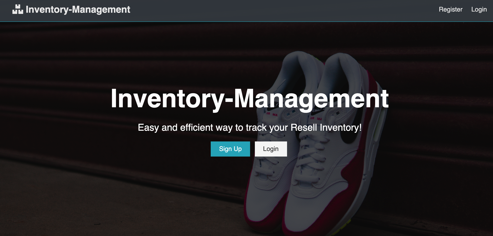

# Inventory-Management

Inventory-Management is a web-based, mobile-friendly application to keep track of your reslling inventory powered by React.

# Motivation

My friends recently got into reselling concert tickets. To help keep track of inventory and cash flow, I created Inventory-Management to easily store the inventory and manage the cash flow.

# Screenshots

# Tech/Framworks used

Front End:
- React
- Redux 
- Materialize Ui
- Materialize Table

Backend: 
- Nodejs
- Express
- Json Web Token (JWT)
- Bcrypt
- MongoDB Atlas
- Mongoose

# Features

- Simple overview of cashflow (Total Revenue, Total Investment, Total Profit)
- Export data to CSV
- Filtering 
- Easy access via web and mobile
- Quick searching ability
